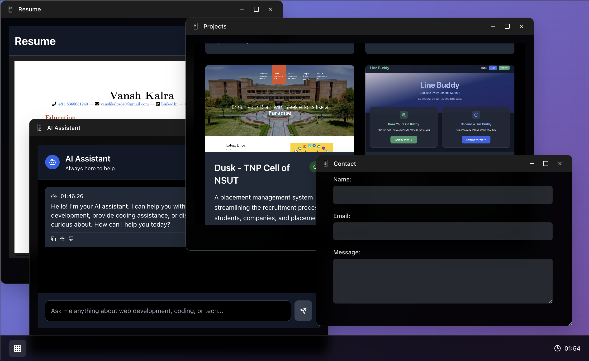

# WebOS - Browser-Based Desktop Experience

Experience a complete desktop operating system environment right in your web browser! WebOS is a modern, interactive desktop simulation built with React that brings familiar OS functionality to the web.



## 🌟 Features

### 🖥️ Complete Desktop Environment
- **Draggable & Resizable Windows** - Full window management with smooth interactions
- **Application Grid** - Organized app launcher with beautiful animations
- **Taskbar & System Tray** - Real-time clock and minimized window management
- **Welcome Animation** - Stunning 3D cube loader with floating elements

### 📱 Built-in Applications
- **About** - Learn about the WebOS platform and its features
- **Contact** - Interactive contact form with multiple communication channels
- **Skills** - Dynamic skill showcase with animated progress bars
- **Projects** - Portfolio gallery with live demos and GitHub links
- **Resume** - Embedded PDF viewer with download functionality
- **AI Assistant** - Real-time chat assistant powered by AI

### 🎨 Modern Design
/*- **Glass Morphism UI** - Beautiful translucent interfaces with backdrop blur*/
- **Responsive Layout** - Works seamlessly across desktop and mobile devices
- **Smooth Animations** - Fluid transitions and micro-interactions
- **Dark Theme** - Easy on the eyes with professional aesthetics

## 🚀 Getting Started

### Prerequisites
- Node.js (v14 or higher)
- npm or yarn package manager

### Installation

1. **Clone the repository**
   ```bash
   git clone https://github.com/vanshkallra/web-os.git
   cd web-os
   ```

2. **Install dependencies**
   ```bash
   npm install
   ```

3. **Start development server**
   ```bash
   npm run dev
   ```

4. **Open your browser**
   Navigate to `http://localhost:3000` to experience WebOS!

### Build for Production
```bash
npm run build
npm run preview
```

## 🛠️ Technology Stack

### Frontend Framework
- **React 18** - Modern component-based architecture
- **Redux Toolkit** - Powerful state management
- **Vite** - Lightning-fast build tool and dev server

### UI & Styling
- **Tailwind CSS** - Utility-first CSS framework
- **Custom CSS** - Hand-crafted glass morphism effects
- **Lucide React** - Beautiful SVG icon library

### Interactions
- **Custom Drag & Drop** - Smooth window management
- **Resize Handlers** - Interactive window resizing
- **Keyboard Navigation** - Full accessibility support

### Additional Features
- **Moment.js** - Real-time clock functionality
- **AI Integration** - Backend API for intelligent responses
- **PDF Embedding** - Resume viewer with Google Drive integration

## 📁 Project Structure

```
web-os/
├── public/
│   ├── assets/
│   │   ├── images/        # Project screenshots
│   │   └── Resume/        # PDF documents
│   └── icons/             # App icons
├── src/
│   ├── components/
│   │   ├── blueprint/     # Core UI components
│   │   ├── template/      # Window templates
│   │   └── views/         # Application content
│   ├── store/             # Redux state management
│   ├── assets/
│   │   ├── css/           # Styling files
│   │   └── icons/         # Additional icons
│   └── App.jsx            # Main application entry
└── README.md
```

## 🎯 Key Components

### Window Management
- **WindowManager.jsx** - Orchestrates all open windows
- **Window.jsx** - Individual window component with drag/resize
- **AppGrid.jsx** - Application launcher interface

### Applications
- **About.jsx** - Platform information and features
- **Contact.jsx** - Contact form with FormSubmit integration
- **Projects.jsx** - Portfolio showcase with live links
- **Resume.jsx** - PDF viewer with download functionality
- **AIAssistant.jsx** - Interactive chat interface

### Core Features
- **store.js** - Redux state with window positioning logic
- **Navbar.jsx** - Bottom taskbar with system controls

## 🌐 Live Demo

Experience WebOS live at: **[weboslive.vercel.app](https://weboslive.vercel.app)**

## 🤝 Contributing

Contributions are welcome! Here's how you can help:

1. **Fork the repository**
2. **Create a feature branch** (`git checkout -b feature/amazing-feature`)
3. **Commit your changes** (`git commit -m 'Add amazing feature'`)
4. **Push to the branch** (`git push origin feature/amazing-feature`)
5. **Open a Pull Request**

### Development Guidelines
- Follow React best practices
- Maintain consistent code formatting
- Test all window interactions
- Ensure responsive design compatibility

## 📝 License

This project is open source and available under the MIT License.

## 👨‍💻 Developer

**Vansh Kalra**
- GitHub: [@vanshkallra](https://github.com/vanshkallra)
- Email: vanshkalra.pro@gmail.com
- Website: [weboslive.vercel.app](https://weboslive.vercel.app)

## 🙏 Acknowledgments

- Inspired by modern desktop environments
- Built with React ecosystem best practices
- UI design influenced by macOS and Windows aesthetics
- Thanks to the open-source community for amazing tools

## 🔮 Future Enhancements

- [ ] **File System Simulation** - Virtual file explorer
- [ ] **More Applications** - Calculator, notepad, music player
- [ ] **Themes Support** - Multiple color schemes
- [ ] **Multi-user Support** - Personal workspaces
- [ ] **Offline Functionality** - Service worker integration
- [ ] **Mobile Optimization** - Touch-friendly interactions

---

**⭐ Star this repository if you found WebOS interesting!**

*Transform your browser into a complete desktop experience with'
